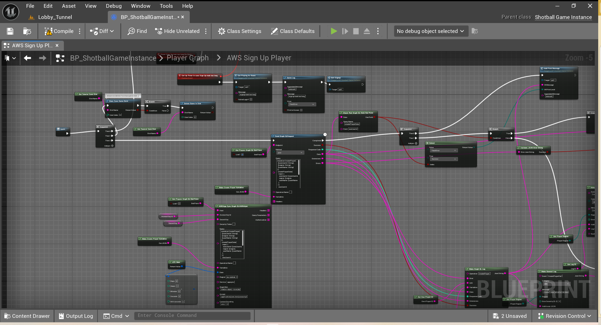

# Game Instance

* game config
* LogDiagnostics

## Dedicated Server

* server check
* create eos session

#### Create EOS Session

<figure><figcaption></figcaption></figure>

* get firestore game state document and modifiers
* get data

**Session Filters**

<figure><figcaption></figcaption></figure>

* upload failure logs to s3
* put log in cloudwatch
* host beacon
  * set beacon port
* shutdown if couldn't host session

## Player

<figure><figcaption></figcaption></figure>

* settings from gameusersettings
* load custom player settings from saved struct

### Login

<figure><figcaption></figcaption></figure>

* set as guest if failed login
* check user exists in dynamo

### Sign Up

* create player in dynamo

<figure><figcaption></figcaption></figure>

* retry or continue as guest

## Query Process

<figure><figcaption></figcaption></figure>

* join with party from previous session dedicated server
* set and recalibrate steam purchased items
* get player doc from dynamo

<figure><figcaption></figcaption></figure>

* add default player items
* open tutorial for new player

#### Challenges

* get challenges from dynamo
* app sync update challenges daily & weekly
* **subscribe to challenges dynamo**

<figure><figcaption></figcaption></figure>

<figure><figcaption></figcaption></figure>

* get friends from steam
* get friend level and equipped items from dynamo

<figure><figcaption></figcaption></figure>

* verify player loadouts match rules & server
* check and claim rewards
* set steam achievements
* set analytics

<figure><figcaption></figcaption></figure>

